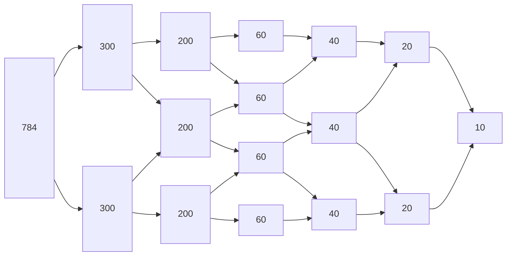

Homework_7 Functional API - graph
===

```mermaid
graph LR
input[<br/><br/><br/><br/>784<br/><br/><br/><br/><br/>] --> L11[<br/><br/>300<br/><br/><br/>]
input --> L12[<br/><br/>300<br/><br/><br/>]

L11 --> L21[<br/>200<br/><br/>]
L11 --> L22[<br/>200<br/><br/>]
L12 --> L22
L12 --> L23[<br/>200<br/><br/>]

L21 --> L31[60]
L21 --> L32[60]
L22 --> L32
L22 --> L33[60]
L23 --> L33
L23 --> L34[60]

L31 --> L41[40]
L32 --> L41
L32 --> L42[40]
L33 --> L42
L33 --> L43[40]
L34 --> L43


L41 --> L51[20]
L42 --> L51 
L42 --> L52[20]
L43 --> L52

L51 --> output[10]
L52 --> output
```